## 📝 পাইথন ফাংশনস
> **Chapter Name: PYTHON FUNCTIONS**
---
---
```
```


### 📝 Notes + Suggestions (কারিগরি পাঠশালা)

> নিচের নোটগুলো **কারিগরি পাঠশালা**-এর Chapter 01-এর গুরুত্বপূর্ণ Concepts ও Suggestions-এর Screenshot।

<br>

<p align="center">
  
</p>

<br>
<p align="center">
  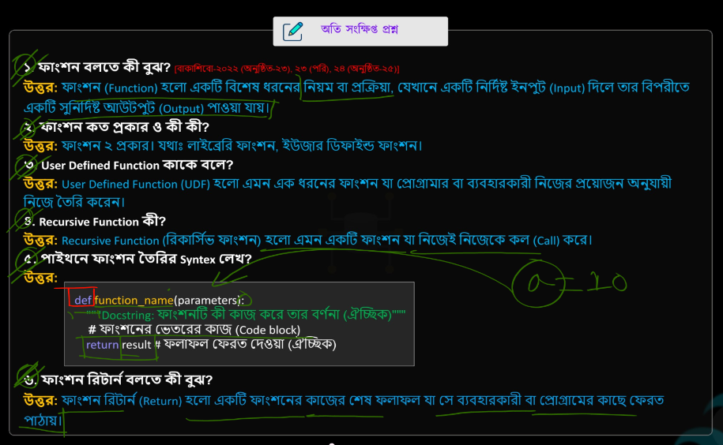
</p>

<br>

<p align="center">
  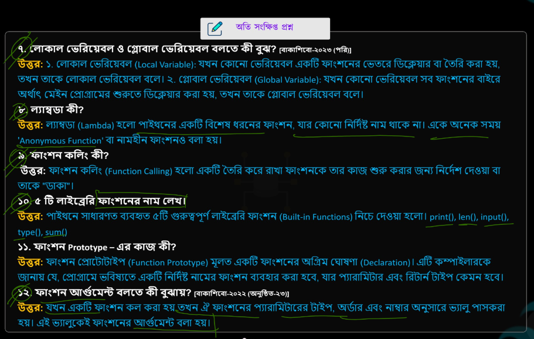
</p>

<br>

<p align="center">
  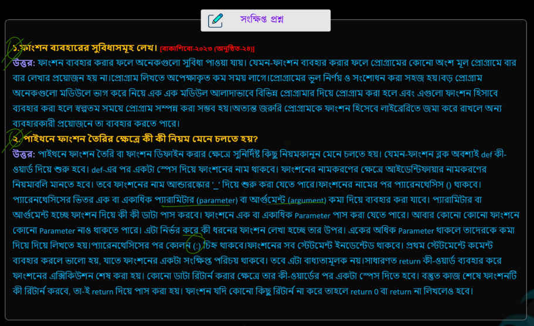
</p>

<br>

<p align="center">
  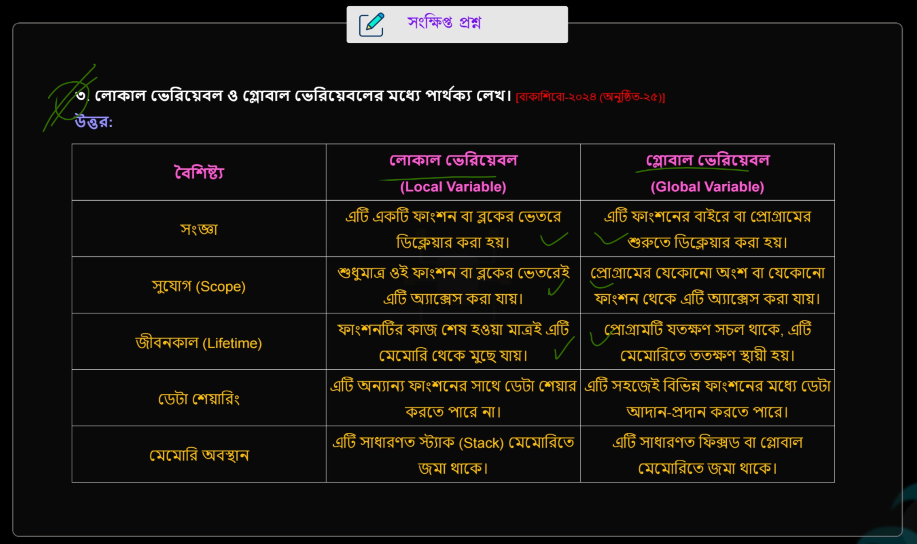
</p>

<br>

<p align="center">
  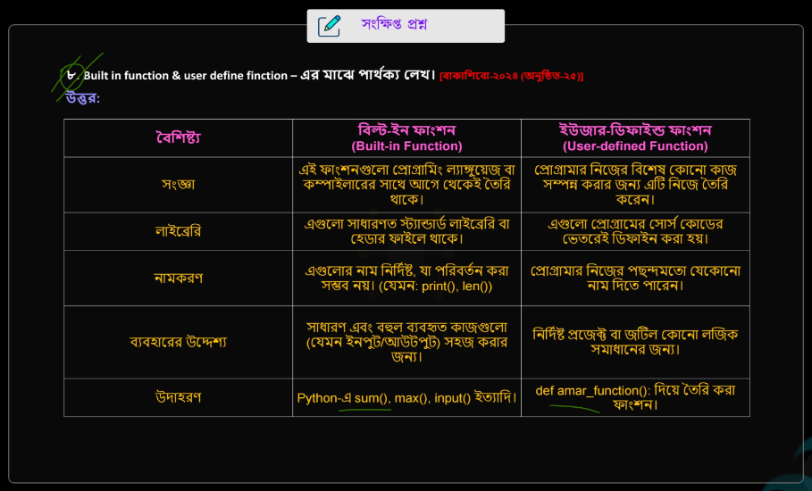
</p>

<br>

<p align="center">
  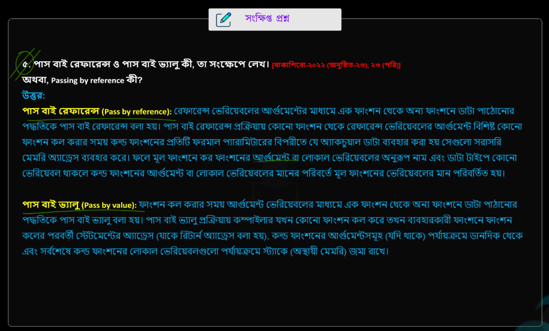
</p>

<br>

<p align="center">
  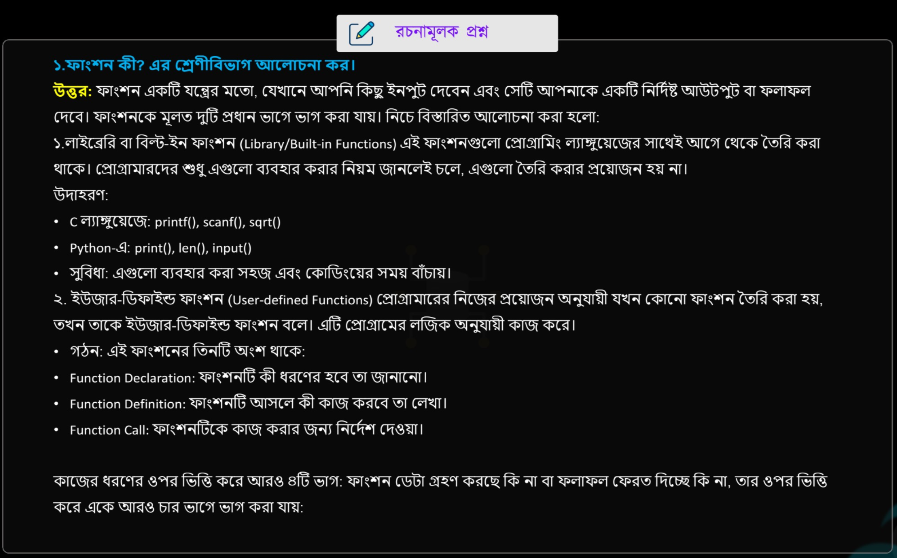
</p>

<br>
<p align="center">
  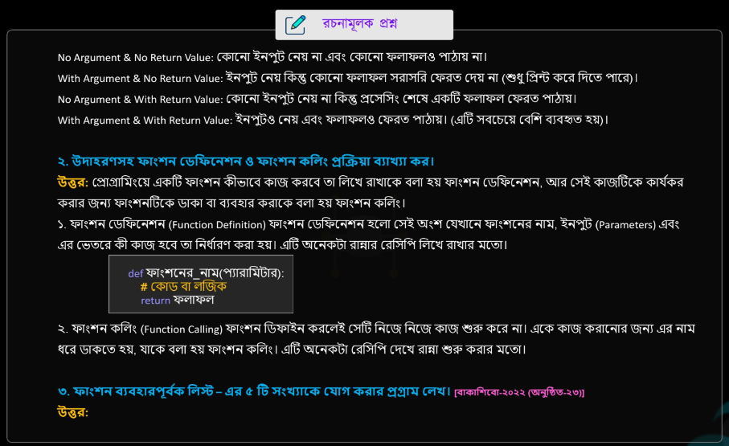
</p>

<br>

<p align="center">
  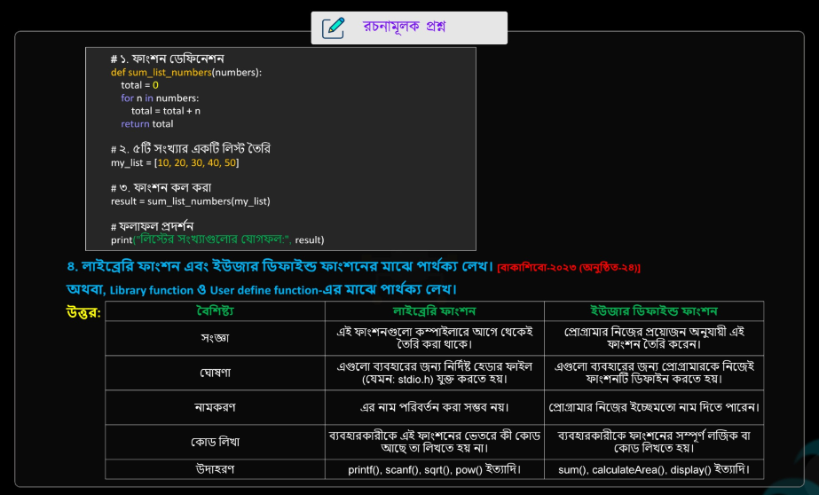
</p>

<br>
<p align="center">
  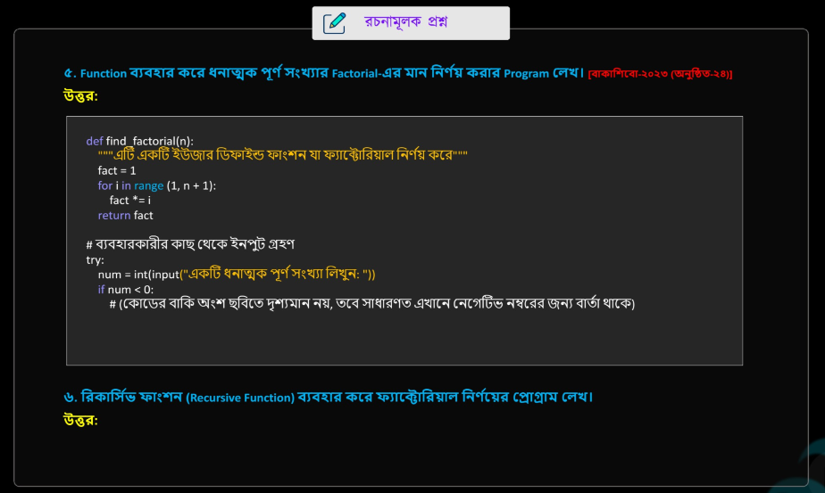
</p>

<br>
<p align="center">
  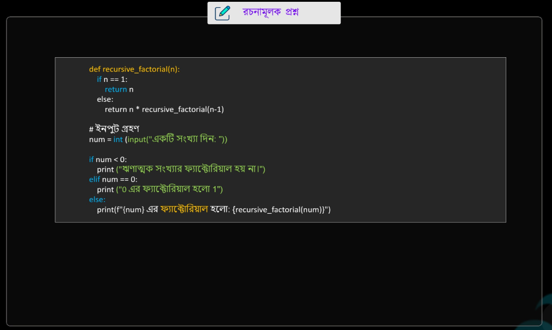
</p>

<br>
<p align="center">
  
</p>

<br>


