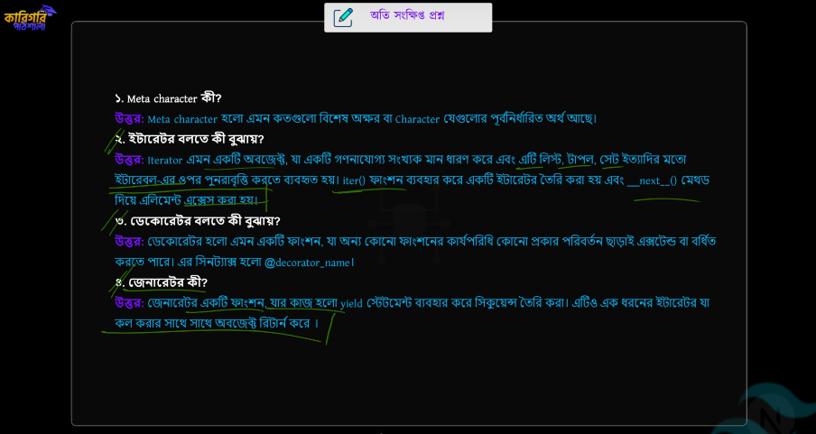
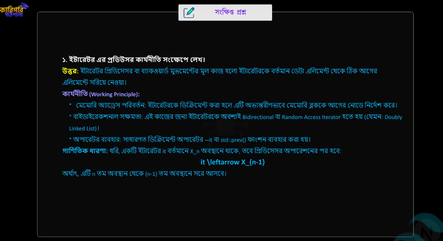
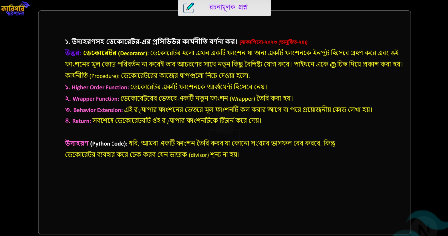
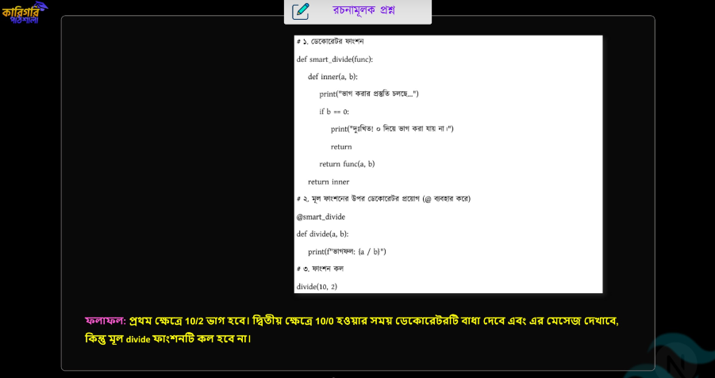
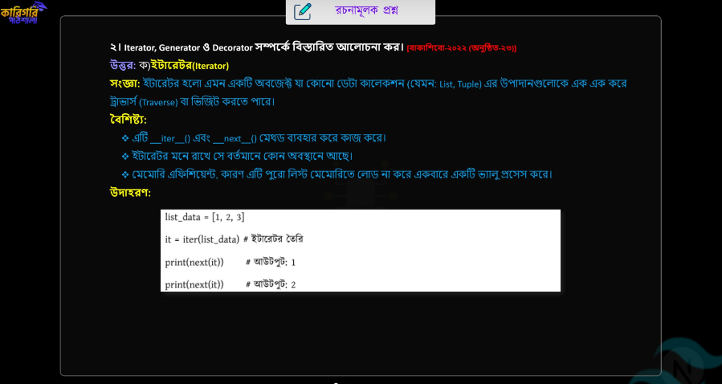
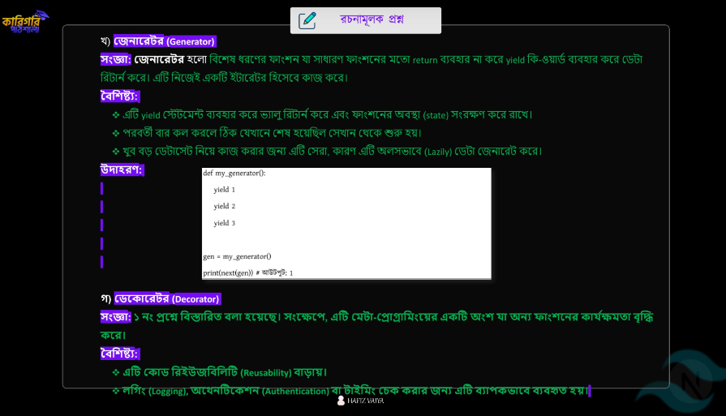

## 📝 পাইথন ইটারেটর, জেনারেটর এবং ডেকোরেটর
> **Chapter Name: PYTHON ITERATOR, GENERATOR AND DECORATORS**
---
 

### 📝 Notes + Suggestions (কারিগরি পাঠশালা)

> নিচের নোটগুলো **কারিগরি পাঠশালা**-এর Chapter 06-এর গুরুত্বপূর্ণ Concepts ও Suggestions-এর Screenshot।

 

  

 

  

 

  

 

  

 

  

 

  

