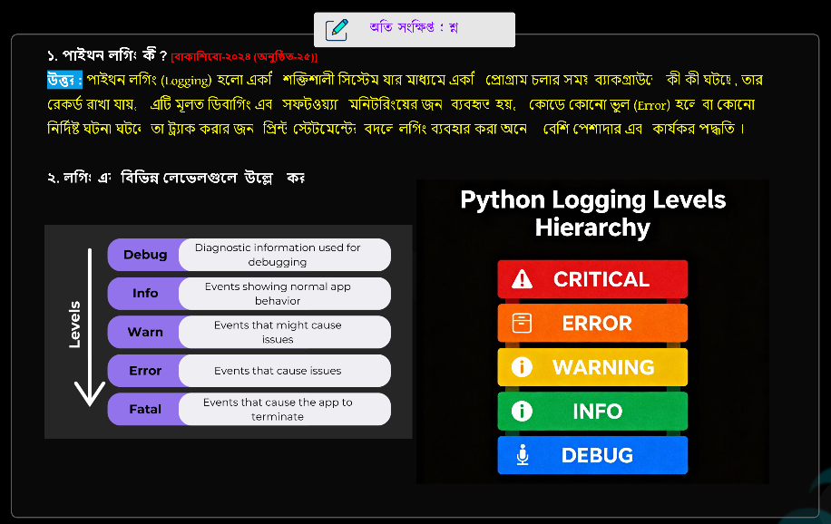
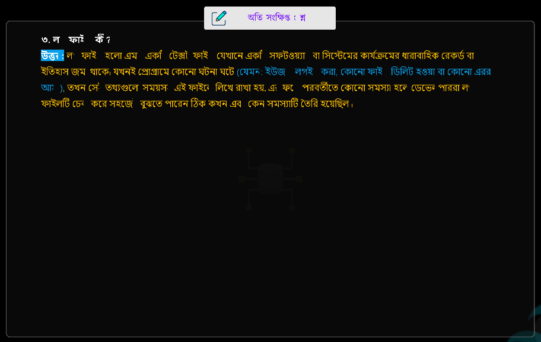
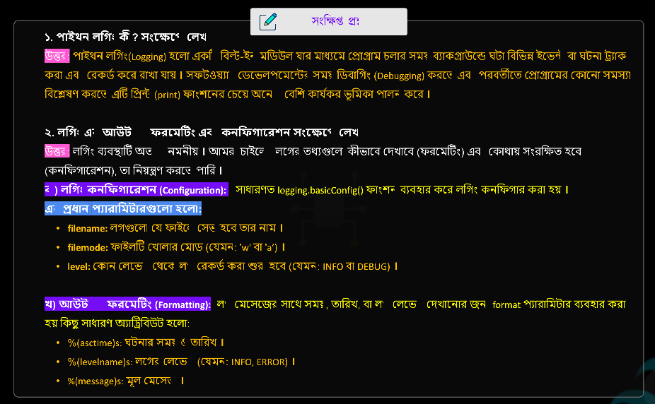
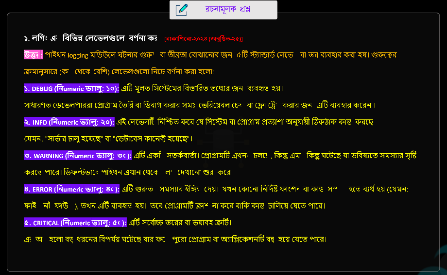
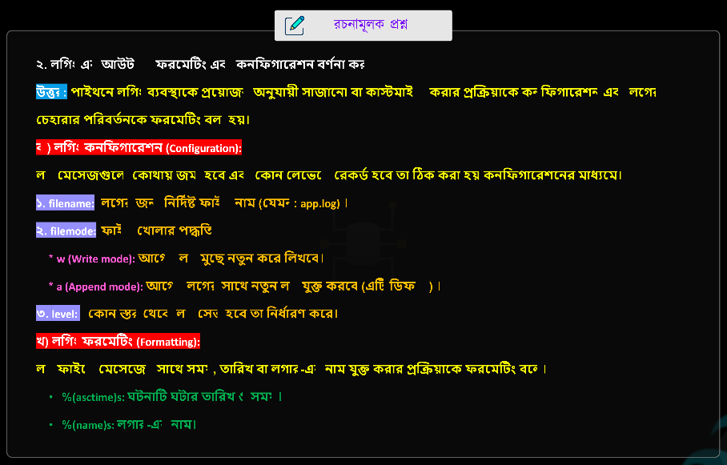

## 📝 পাইথন এর লগিং
> **Chapter Name: LOGGING IN PYTHON**

--- 
<br>


<details>
<summary><strong>📘 Working Procedure of Logging to Terminal (C-04)</strong></summary>

### Code

```python
# importing module
import logging

# to show logs in terminal
logging.basicConfig(
    level=logging.DEBUG,
    format="%(asctime)s - %(message)s - %(levelname)s"
)

# creating a logger object
logger = logging.getLogger()

# setting the logger threshold
logger.setLevel(logging.DEBUG)

# test messages
logger.debug("Harmless Debug Message")
logger.info("Just an Information")
logger.warning("It's a Warning!")
logger.error("Did you try to divide by zero?")
logger.critical("Internet is down")
```

### Output

```text
2026-08-04 13:39:50,028 - Harmless Debug Message - DEBUG
2026-08-04 13:39:50,028 - Just an Information - INFO
2026-08-04 13:39:50,029 - It's a Warning! - WARNING
2026-08-04 13:39:50,029 - Did you try to divide by zero? - ERROR
2026-08-04 13:39:50,029 - Internet is down - CRITICAL
```

### Line-by-Line Explanation

- `import logging` → `logging` Module Import করা হয়েছে।
- `logging.basicConfig(...)` → Logger-এর Basic Configuration সেট করা হয়েছে।
- `level=logging.DEBUG` → `DEBUG` এবং এর উপরের সকল Log Level প্রদর্শন করবে।
- `format="%(asctime)s - %(message)s - %(levelname)s"` → Output-এর Format নির্ধারণ করা হয়েছে।
  - `%(asctime)s` → Log তৈরি হওয়ার Date ও Time।
  - `%(message)s` → Log Message।
  - `%(levelname)s` → Log Level-এর নাম (DEBUG, INFO, WARNING, ERROR, CRITICAL)।
- `logger = logging.getLogger()` → একটি Logger Object তৈরি করা হয়েছে।
- `logger.setLevel(logging.DEBUG)` → Logger-এর Threshold `DEBUG` করা হয়েছে।

- `logger.debug(...)` → Debug Level-এর Message Log করে।
- `logger.info(...)` → Information Level-এর Message Log করে।
- `logger.warning(...)` → Warning Level-এর Message Log করে।
- `logger.error(...)` → Error Level-এর Message Log করে।
- `logger.critical(...)` → Critical বা গুরুতর Error Log করে।

### Understanding the Output

- `2026-08-04` → Log তৈরি হওয়ার Date।
- `13:39:50,028` → Time (`Hour:Minute:Second,Millisecond`)।
- `Harmless Debug Message` → User-এর দেওয়া Log Message।
- `DEBUG` → Log Level।
- `028` এবং `029` হলো Milliseconds। কোড খুব দ্রুত Execute হওয়ায় সব Log একই Second-এর মধ্যে তৈরি হয়েছে, তাই Millisecond-এ সামান্য পার্থক্য দেখা যায়।

</details>
<br>


<details>
<summary><strong>📘 Working Procedure of Logging to a File (C-04)</strong></summary>

### Code

```python
import logging

logging.basicConfig(
    level=logging.DEBUG,
    filename="server.log",
    format="%(asctime)s - %(message)s - %(levelname)s",
)

logger = logging.getLogger()

logger.setLevel(logging.DEBUG)

# Add a blank line before each program run
logging.info("\n")

logger.debug("Harmless Debug Message")
logger.info("This is an Info Message")
logger.warning("warning......!!!")
logger.error("Devide by Zero")
logger.critical("Server is down!!")
```

### Output (`server.log`)

```text
2026-08-04 14:02:33,726 - Harmless Debug Message - DEBUG
2026-08-04 14:02:33,726 - This is an Info Message - INFO
2026-08-04 14:02:33,726 - warning......!!! - WARNING
2026-08-04 14:02:33,726 - Devide by Zero - ERROR
2026-08-04 14:02:33,726 - Server is down!! - CRITICAL

2026-08-04 14:03:09,969 - Harmless Debug Message - DEBUG
2026-08-04 14:03:09,969 - This is an Info Message - INFO
2026-08-04 14:03:09,969 - warning......!!! - WARNING
2026-08-04 14:03:09,969 - Devide by Zero - ERROR
2026-08-04 14:03:09,969 - Server is down!! - CRITICAL
```

### Working Process

1. `import logging`
   - `logging` Module Import করা হয়েছে।

2. `logging.basicConfig(...)`
   - Logger-এর Basic Configuration করা হয়েছে।
   - `filename="server.log"` → Output `server.log` File-এ Save হবে।
   - `level=logging.DEBUG` → `DEBUG` এবং এর উপরের সব Log Level Save হবে।
   - `format=...` → Date, Time, Message এবং Log Level-এর Format নির্ধারণ করে।

3. `logger = logging.getLogger()`
   - একটি Logger Object তৈরি করা হয়েছে।

4. `logger.setLevel(logging.DEBUG)`
   - Logger-এর Threshold `DEBUG` করা হয়েছে।

5. `logging.info("\n")`
   - প্রতিবার Program Run হলে `server.log`-এ একটি Blank Line যোগ করবে, যাতে আগের ও নতুন Output-এর মধ্যে Gap থাকে।

6. `logger.debug()`, `logger.info()`, `logger.warning()`, `logger.error()`, `logger.critical()`
   - বিভিন্ন Log Level-এর Message `server.log` File-এ লিখে।

### How to Run

```bash
python 03_server.py
```

অথবা

```bash
py 03_server.py
```

### Where is the Output?

- Terminal-এ কোনো Log Output দেখাবে না।
- একই Folder-এ তৈরি হওয়া **`server.log`** File খুলে Output দেখতে হবে।

### How Does the Output Update?

- Program আবার Run করলেই `server.log` Update হবে।

- `filemode="a"` (Default)
  - পুরোনো Log রেখে নতুন Log শেষে যোগ হবে।

- `filemode="w"`
  - প্রতিবার Run করলে পুরোনো Log মুছে নতুন Log লেখা হবে।

</details>
<br>


```
2026-08-04 13:39:50,028 - Harmless Debug Message - DEBUG
│                    │                  │         │
│                    │                  │         └── Log Level
│                    │                  └──────────── Message
│                    └────────────────────────────── Time (13:39:50.028)
└────────────────────────────────────────────────── Date (2026-08-04)
```


```
```


### 📝 Notes + Suggestions (কারিগরি পাঠশালা)

> নিচের নোটগুলো **কারিগরি পাঠশালা**-এর Chapter 08-এর গুরুত্বপূর্ণ Concepts ও Suggestions-এর Screenshot।

<br>

<p align="center">
  
</p>

<br>

<p align="center">
  
</p>

<br>

<p align="center">
  
</p>

<br>

<p align="center">
  
</p>

<br>

<p align="center">
  
</p>

<br>

<p align="center">
  
</p>


