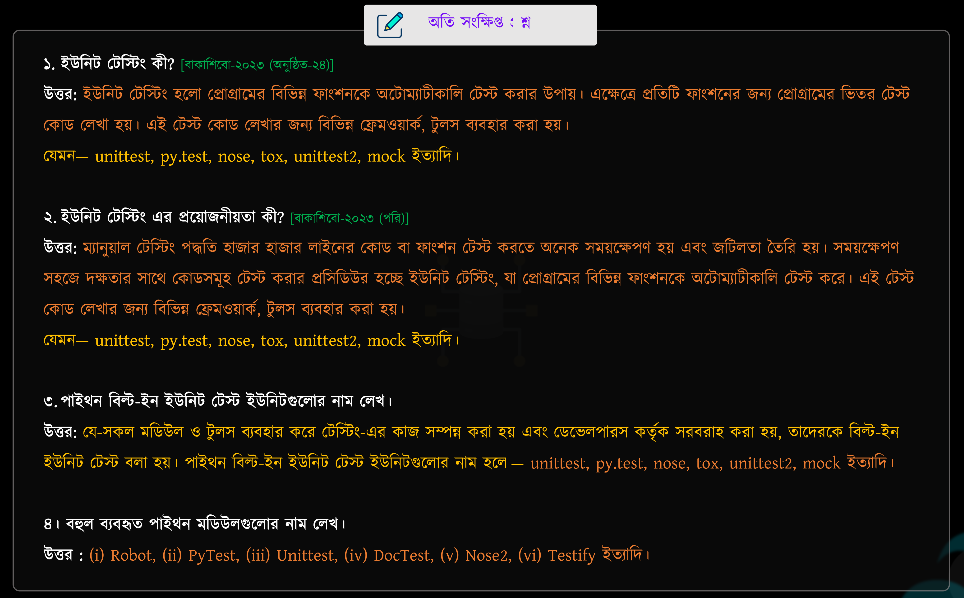
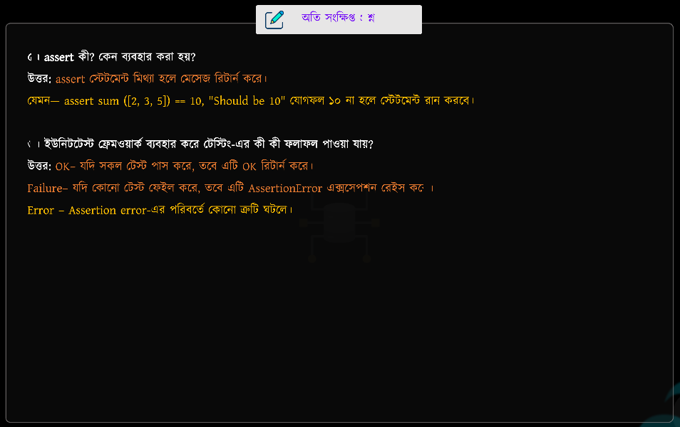
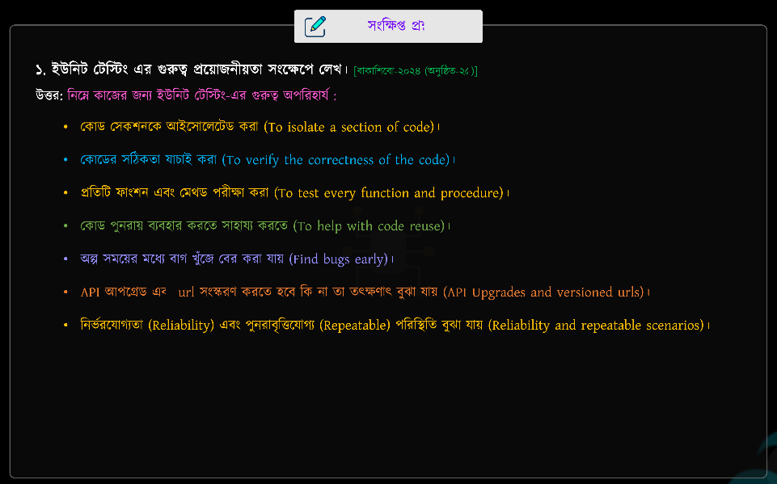
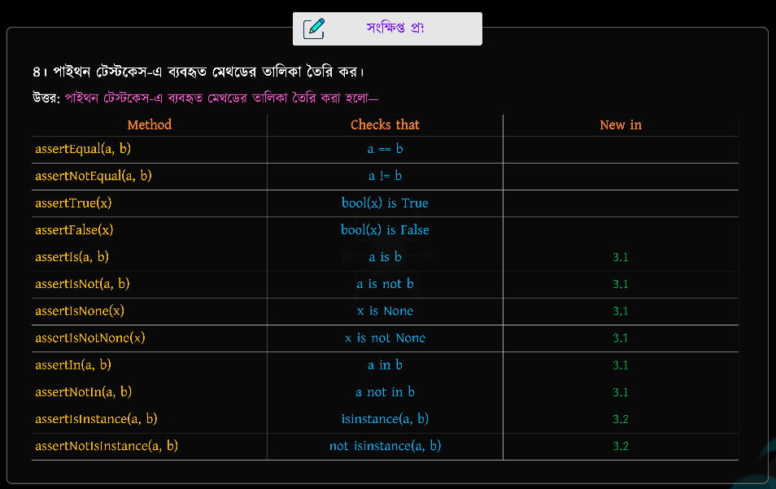
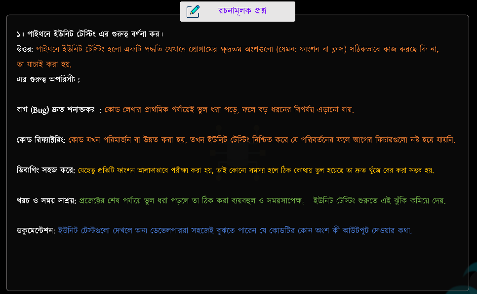
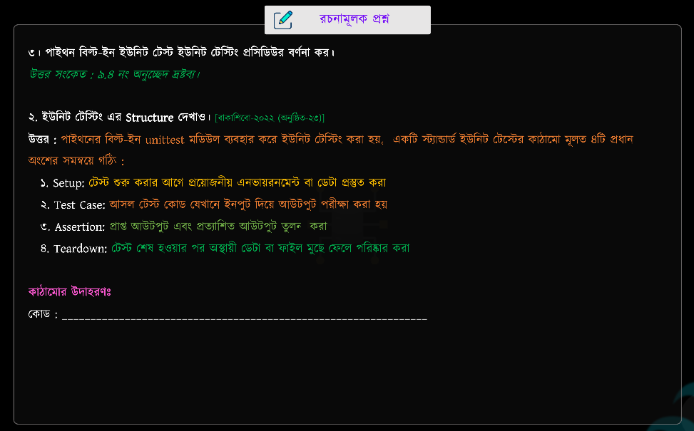

## 📝 ইউনিট টেস্টিং
> **Chapter Name: UNIT TESTING**

--- 
<br>


<details>
<summary><strong>📘 Unit Testing Example (calculator.py & test_calculator.py)</strong></summary>

### 📄 `calculator.py`

```python
def add(a, b):
    return a + b


def subtract(a, b):
    return a - b
```

---

### 📄 `test_calculator.py`

```python
import unittest
from calculator import add, subtract


class TestCalculator(unittest.TestCase):

    def test_add(self):
        self.assertEqual(add(2, 3), 5)

    def test_subtract(self):
        self.assertEqual(subtract(10, 5), 5)


if __name__ == "__main__":
    unittest.main()
```

---

### ▶️ Run the Test

```bash
python test_calculator.py
```

**OR**

```bash
python -m unittest test_calculator.py
```

---

### ✅ Output

```text
..
----------------------------------------------------------------------
Ran 2 tests in 0.001s

OK
```

#### Output Explanation

- `..` → Two test methods (`test_add()` and `test_subtract()`) passed successfully.
- `Ran 2 tests` → A total of **2 tests** were executed.
- `OK` → All tests passed without any errors or failures.

</details>
<br>


<details>
<summary><strong>📘 Basic Unit Testing Example (Single File)</strong></summary>

### 📄 `test.py`

```python
import unittest


# Function
def add(a, b):
    return a + b


# Test Class
class TestCalculator(unittest.TestCase):

    def test_add(self):
        self.assertEqual(add(2, 3), 5)


if __name__ == "__main__":
    unittest.main()
```

---

### ▶️ Run the Test

```bash
python test.py
```

**OR**

```bash
python -m unittest test.py
```

---

### ✅ Output

```text
.
----------------------------------------------------------------------
Ran 1 test in 0.001s

OK
```

---

### 📝 Output Explanation

- `.` → One test method (`test_add()`) passed successfully.
- `Ran 1 test` → A total of **1 test** was executed.
- `OK` → The test completed successfully without any errors or failures.

</details>
<br>


<details>
<summary><strong>📘 Common Unit Testing Outputs (OK, FAIL & ERROR)</strong></summary>

## ✅ 1. OK

**When does it appear? (কখন দেখা যায়?)**

- All test cases pass successfully.
- All expected results match the actual results.
- No errors or assertion failures occur.

**বাংলা ব্যাখ্যা:**

`OK` দেখায় যখন **সকল Test Case সফলভাবে Pass করে**। অর্থাৎ, প্রত্যেকটি Assertion সঠিক ফলাফল পায় এবং কোনো Error বা Failure ঘটে না।

**Example Output**

```text
.
----------------------------------------------------------------------
Ran 1 test in 0.001s

OK
```

---

## ❌ 2. FAIL

**When does it appear? (কখন দেখা যায়?)**

- The test runs successfully.
- The expected result does not match the actual result.
- An assertion such as `assertEqual()` or `assertTrue()` fails.

**বাংলা ব্যাখ্যা:**

`FAIL` দেখায় যখন **Test ঠিকমতো Run হয়**, কিন্তু **Expected Result** এবং **Actual Result** এক হয় না। অর্থাৎ, `assertEqual()`, `assertTrue()` ইত্যাদি Assertion ব্যর্থ হলে এই Output দেখা যায়।

**Example Output**

```text
F

======================================================================
FAIL: test_add
AssertionError: -1 != 5

----------------------------------------------------------------------
Ran 1 test

FAILED (failures=1)
```

---

## 💥 3. ERROR

**When does it appear? (কখন দেখা যায়?)**

- An unexpected error occurs while running the test.
- The test cannot complete because the program raises an exception.

**বাংলা ব্যাখ্যা:**

`ERROR` দেখায় যখন **Test সম্পূর্ণ হওয়ার আগেই Program-এ একটি Exception ঘটে**। যেমন `ZeroDivisionError`, `TypeError`, `NameError` ইত্যাদি। এ ক্ষেত্রে Assertion পর্যন্ত পৌঁছানোই সম্ভব হয় না।

**Example Output**

```text
E

======================================================================
ERROR: test_divide
ZeroDivisionError: division by zero

----------------------------------------------------------------------
Ran 1 test

FAILED (errors=1)
```

---

### 📝 Summary

| Output | বাংলা অর্থ |
|:------:|------------|
| ✅ **OK** | সকল Test সফলভাবে Pass করেছে। |
| ❌ **FAIL** | Test Run হয়েছে, কিন্তু Assertion ব্যর্থ হয়েছে। |
| 💥 **ERROR** | Test Run করার সময় Program-এ Exception ঘটেছে। |

</details>
<br>


---
---

## 📘 Common `unittest.TestCase` Methods

| Method | Checks that | New in |
|:-------|:------------|:------:|
| `assertEqual(a, b)` | `a == b` | – |
| `assertNotEqual(a, b)` | `a != b` | – |
| `assertTrue(x)` | `bool(x)` is `True` | – |
| `assertFalse(x)` | `bool(x)` is `False` | – |
| `assertIs(a, b)` | `a is b` | – |
| `assertIsNot(a, b)` | `a is not b` | – |
| `assertIsNone(x)` | `x is None` | – |
| `assertIsNotNone(x)` | `x is not None` | – |
| `assertIn(a, b)` | `a in b` | – |
| `assertNotIn(a, b)` | `a not in b` | – |
| `assertIsInstance(obj, cls)` | `isinstance(obj, cls)` | – |
| `assertNotIsInstance(obj, cls)` | `not isinstance(obj, cls)` | – |

<br>

| Method | Checks that | New in |
|:-------|:------------|:------:|
| `assertRaises(exc)` | Raises the specified exception | – |
| `assertRaisesRegex(exc, regex)` | Raises exception with matching message | Python 3.1 |
| `assertWarns(warning)` | Raises the specified warning | Python 3.2 |
| `assertWarnsRegex(warning, regex)` | Raises warning with matching message | Python 3.2 |
| `assertAlmostEqual(a, b)` | `a` and `b` are approximately equal | – |
| `assertNotAlmostEqual(a, b)` | `a` and `b` are not approximately equal | – |
| `assertGreater(a, b)` | `a > b` | Python 3.1 |
| `assertGreaterEqual(a, b)` | `a >= b` | Python 3.1 |
| `assertLess(a, b)` | `a < b` | Python 3.1 |
| `assertLessEqual(a, b)` | `a <= b` | Python 3.1 |
| `assertRegex(text, regex)` | Text matches the regular expression | Python 3.1 |
| `assertNotRegex(text, regex)` | Text does not match the regular expression | Python 3.2 |
| `assertCountEqual(a, b)` | Same elements regardless of order | Python 3.2 |
| `assertMultiLineEqual(a, b)` | Multiline strings are equal | Python 3.1 |
<br>


---
---

### 📝 Notes + Suggestions (কারিগরি পাঠশালা)

> নিচের নোটগুলো **কারিগরি পাঠশালা**-এর Chapter 09-এর গুরুত্বপূর্ণ Concepts ও Suggestions-এর Screenshot।

<br>

<p align="center">
  
</p>

<br>

<p align="center">
  
</p>

<br>

<p align="center">
  
</p>

<br>

<p align="center">
  
</p>

<br>

<p align="center">
  
</p>

<br>

<p align="center">
  
</p>

<br>

<p align="center">
  
</p>

<br>

<p align="center">
  
</p>