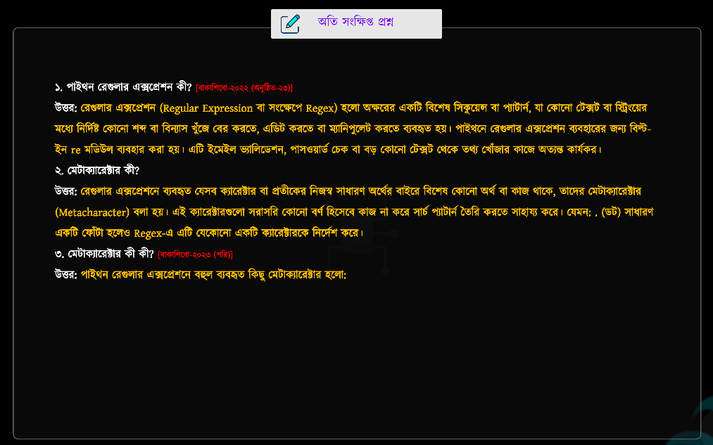
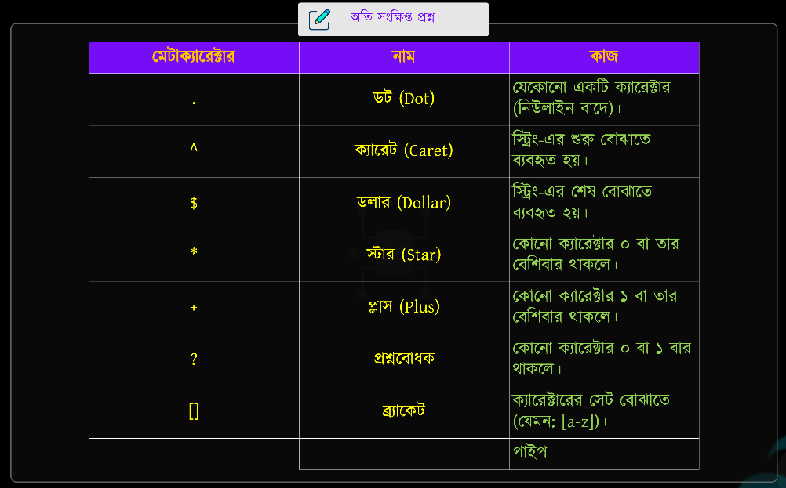
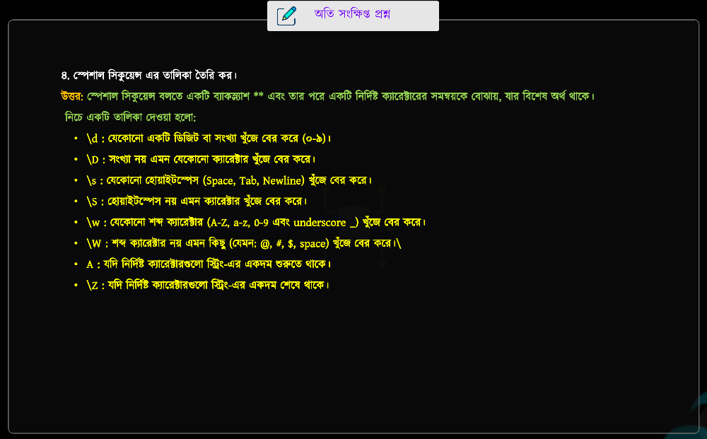
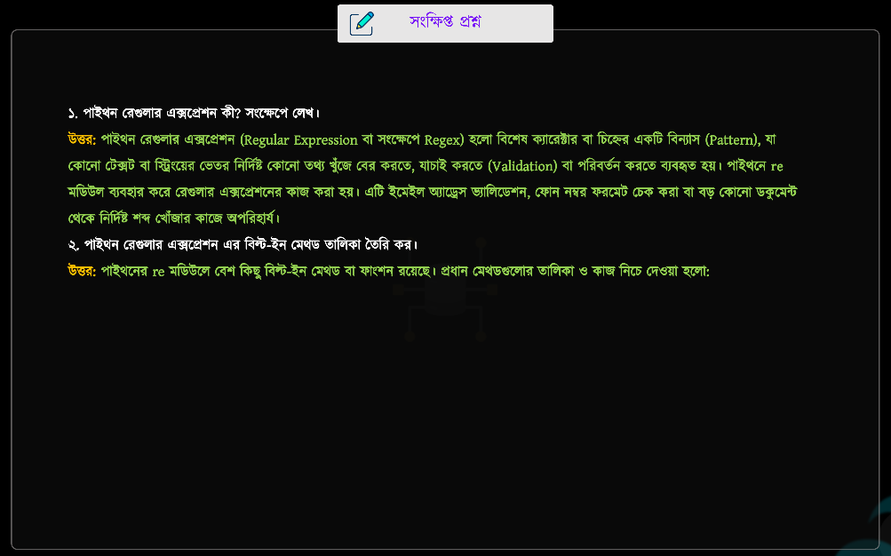
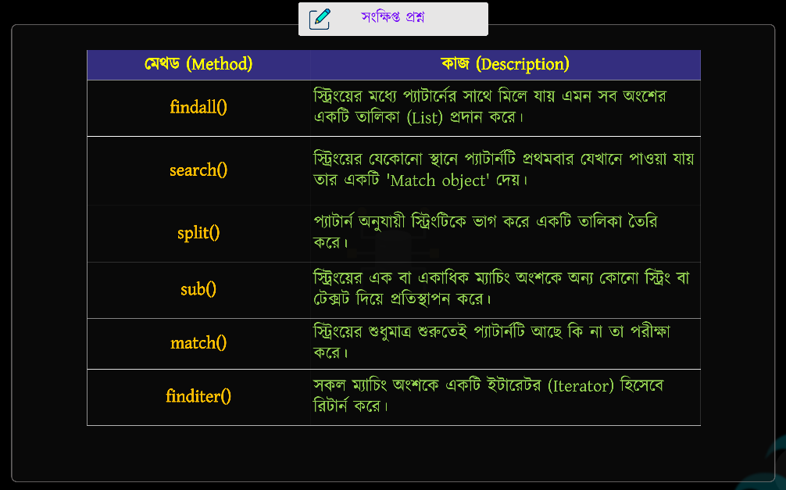
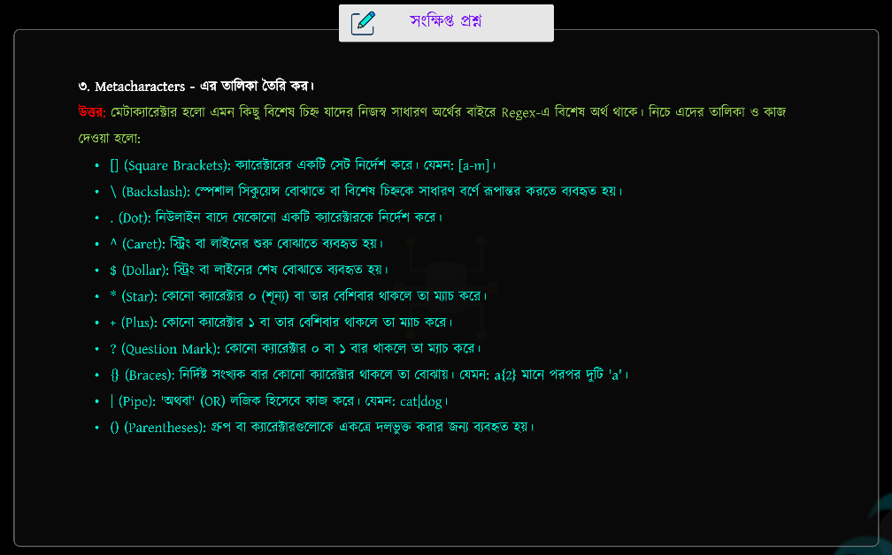
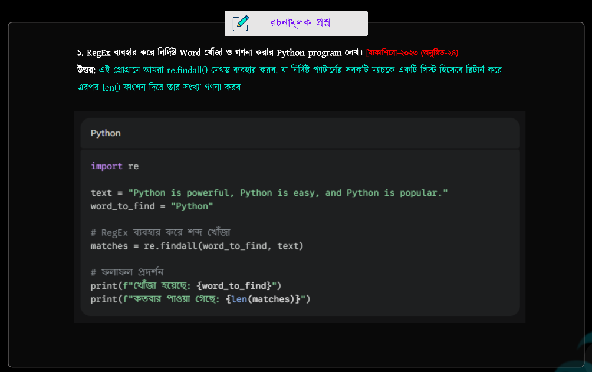
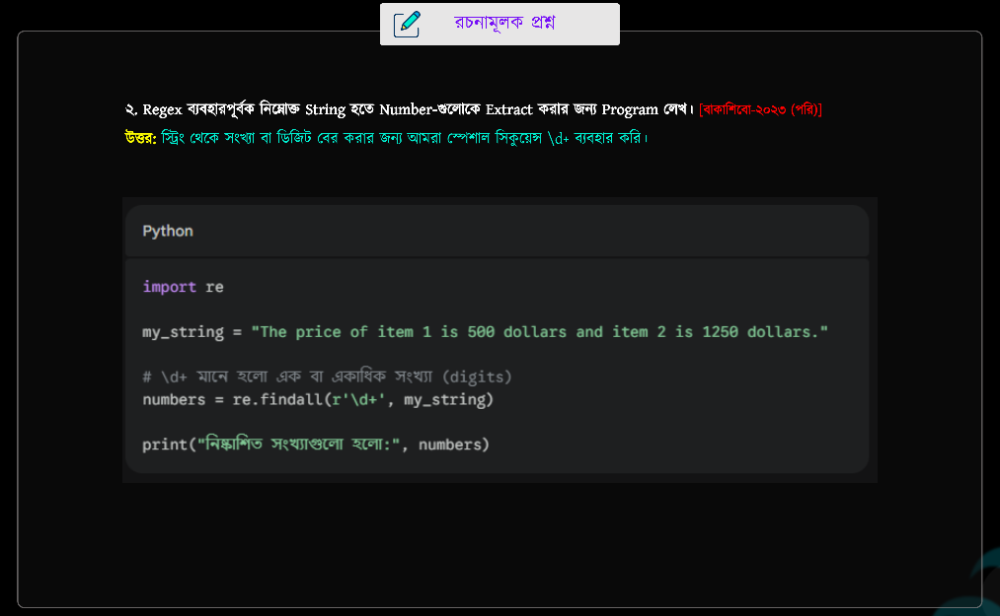
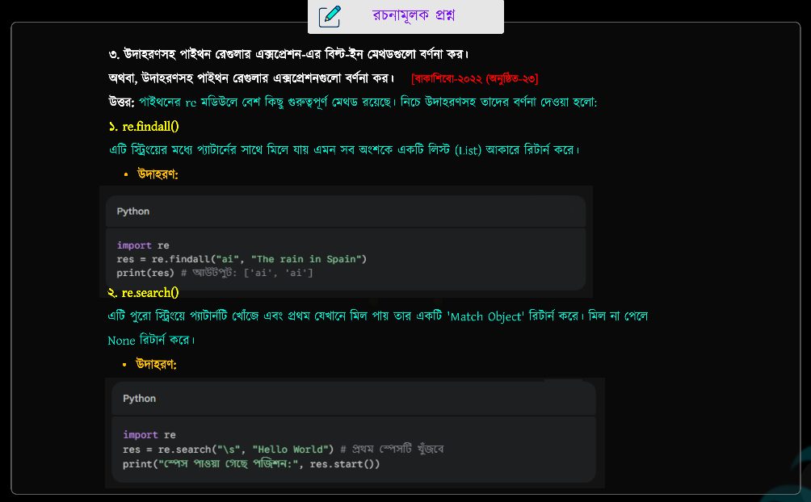
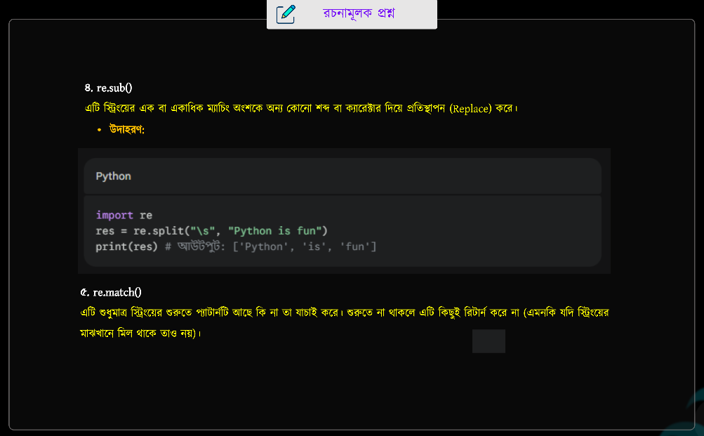

## 📝 পাইথন রেগুলার এক্সপ্রেশন
> **Chapter Name: PYTHON RegEx. (REGULAR EXPRESSION)**

--- 
<br>


### ❔ Python RegEx (Regular Expression) কী?

- RegEx (Regular Expression) হলো একটি বিশেষ Pattern (নিয়ম), যা ব্যবহার করে কোনো String-এর মধ্যে নির্দিষ্ট লেখা (text) খুঁজে বের করা, মিলানো (match), পরিবর্তন (replace), বা যাচাই (validate) করা যায়।

- Python-এ RegEx ব্যবহার করতে হলে re (regular expression) module import করতে হয়।
---


## 📝 Common Syntax of Python RegEx

```python
import re

result = re.method(pattern, string)
```

**যেখানে,**

- `re` → Regular Expression Module
- `method` → `search()`, `match()`, `findall()`, `finditer()`, `fullmatch()` ইত্যাদি
- `pattern` → যে Pattern বা Text খুঁজবে
- `string` → যে String-এর মধ্যে খুঁজবে
- `result` → Method-এর Return Value সংরক্ষণ করে
<br>


## 📋 Python RegEx Built-in Methods

| Method | কাজ (Purpose) | Return Type |
| :------ | :------------ | :---------- |
| `re.search()` | String-এর মধ্যে **প্রথম Match** খুঁজে বের করে। | Match Object / `None` |
| `re.match()` | String-এর **শুরু (Beginning)** থেকে Match করে। | Match Object / `None` |
| `re.findall()` | সব Match খুঁজে **List** আকারে Return করে। | `list` |
| `re.finditer()` | সব Match-এর **Iterator** Return করে। | Iterator |
| `re.split()` | Pattern অনুযায়ী String-কে ভাগ (Split) করে। | `list` |
| `re.sub()` | Match হওয়া Text অন্য Text দিয়ে Replace করে। | `str` |
| `re.subn()` | Replace করে এবং কতবার Replace হয়েছে সেটিও Return করে। | `tuple` (`new_string`, `count`) |
| `re.fullmatch()` | পুরো String Pattern-এর সাথে Match করলে Return করে। | Match Object / `None` |
| `re.compile()` | একটি RegEx Pattern Compile করে পুনরায় ব্যবহারযোগ্য Pattern Object তৈরি করে। | Pattern Object |
| `re.escape()` | Special Characters-গুলোকে Escape করে Literal Pattern বানায়। | `str` |

<br>

---


<details>
<summary><strong>📖 Python RegEx Built-in Methods (Examples + Short Notes)</strong></summary>

---

<details>
<summary><strong>🔍 re.search()</strong></summary>

**Short Note:** String-এর মধ্যে **প্রথম Match** খুঁজে বের করে। Match না পেলে `None` Return করে।

```python
import re

text = "I love Python"

result = re.search("Python", text)

print(result.group())
```

**Output**

```text
Python
```

</details>

---

<details>
<summary><strong>🎯 re.match()</strong></summary>

**Short Note:** String-এর **শুরু (Beginning)** থেকে Match করে। শুরুতে Match না হলে `None` Return করে।

```python
import re

text = "Hello Python"

result = re.match("Hello", text)

print(result.group())
```

**Output**

```text
Hello
```

</details>

---

<details>
<summary><strong>📋 re.findall()</strong></summary>

**Short Note:** Pattern-এর সাথে মিল থাকা **সবগুলো Match** একটি **List** আকারে Return করে।

```python
import re

text = "Python Java Python C++"

result = re.findall("Python", text)

print(result)
```

**Output**

```text
['Python', 'Python']
```

</details>

---

<details>
<summary><strong>🔄 re.finditer()</strong></summary>

**Short Note:** সব Match-এর জন্য **Iterator** Return করে, যা Loop করে একে একে ব্যবহার করা যায়।

```python
import re

text = "Python Java Python"

result = re.finditer("Python", text)

for item in result:
    print(item.group())
```

**Output**

```text
Python
Python
```

</details>

---

<details>
<summary><strong>✂️ re.split()</strong></summary>

**Short Note:** নির্দিষ্ট Pattern অনুযায়ী String-কে একাধিক অংশে ভাগ (Split) করে।

```python
import re

text = "Apple,Banana,Mango"

result = re.split(",", text)

print(result)
```

**Output**

```text
['Apple', 'Banana', 'Mango']
```

</details>

---

<details>
<summary><strong>🔄 re.sub()</strong></summary>

**Short Note:** Pattern-এর সাথে Match হওয়া Text-কে নতুন Text দিয়ে Replace করে।

```python
import re

text = "I love Python"

result = re.sub("Python", "Java", text)

print(result)
```

**Output**

```text
I love Java
```

</details>

---

<details>
<summary><strong>🔢 re.subn()</strong></summary>

**Short Note:** Replace করার পাশাপাশি **কতবার Replace হয়েছে** সেটিও Return করে।

```python
import re

text = "Python Python Java"

result = re.subn("Python", "C++", text)

print(result)
```

**Output**

```text
('C++ C++ Java', 2)
```

</details>

---

<details>
<summary><strong>✅ re.fullmatch()</strong></summary>

**Short Note:** পুরো String Pattern-এর সাথে Match করলে Match Object Return করে।

```python
import re

text = "Python"

result = re.fullmatch("Python", text)

print(result.group())
```

**Output**

```text
Python
```

</details>

---

<details>
<summary><strong>⚙️ re.compile()</strong></summary>

**Short Note:** একটি Pattern Compile করে বারবার ব্যবহার করার জন্য Pattern Object তৈরি করে।

```python
import re

pattern = re.compile("Python")

result = pattern.search("I love Python")

print(result.group())
```

**Output**

```text
Python
```

</details>

---

<details>
<summary><strong>🔒 re.escape()</strong></summary>

**Short Note:** Special Character-গুলোকে Escape করে Literal Character হিসেবে ব্যবহার করতে সাহায্য করে।

```python
import re

text = "a+b"

print(re.escape(text))
```

**Output**

```text
a\+b
```

</details>

</details>
<br>


---
---

### 📝 Notes + Suggestions (কারিগরি পাঠশালা)

> নিচের নোটগুলো **কারিগরি পাঠশালা**-এর Chapter 10-এর গুরুত্বপূর্ণ Concepts ও Suggestions-এর Screenshot।

<br>

<p align="center">
  
</p>

<br>

<p align="center">
  
</p>

<br>

<p align="center">
  
</p>

<br>

<p align="center">
  
</p>

<br>

<p align="center">
  
</p>

<br>

<p align="center">
  
</p>

<br>

<p align="center">
  
</p>

<br>

<p align="center">
  
</p>

<br>

<p align="center">
  
</p>

<br>

<p align="center">
  
</p>

<br>

<p align="center">
  
</p>

<br>

<p align="center">
  
</p>

<br>
