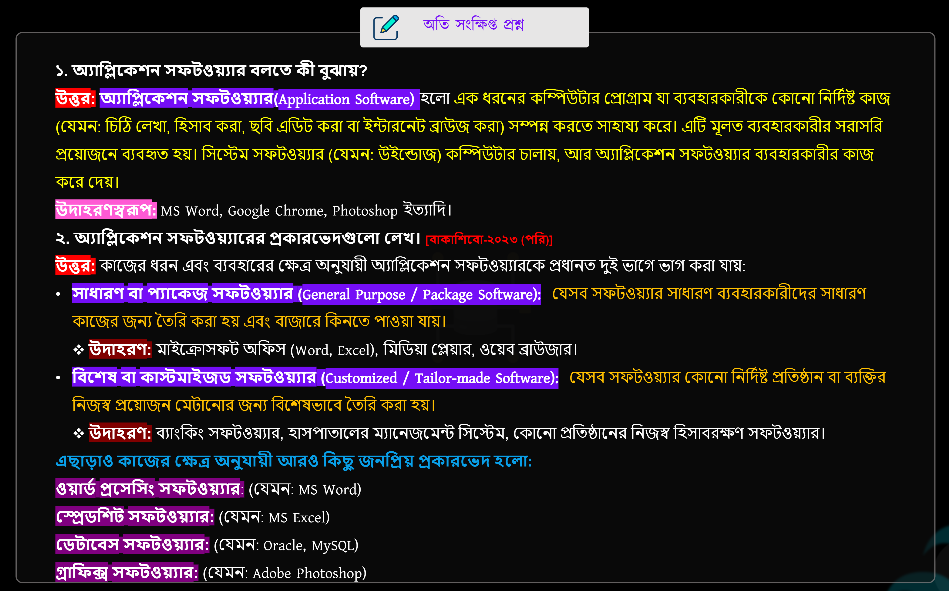
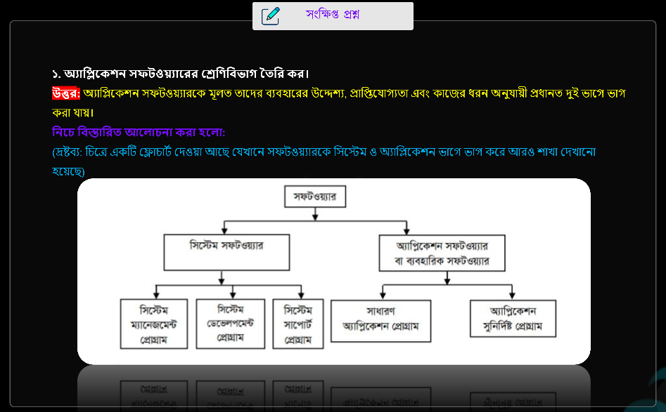
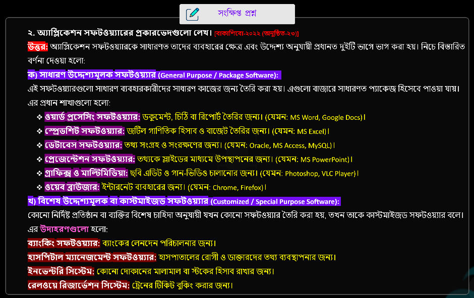
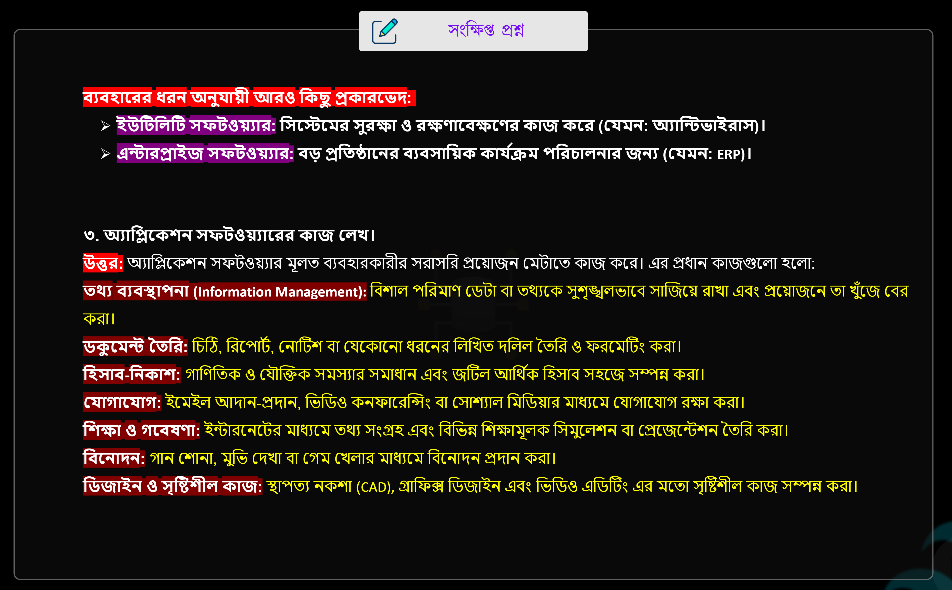
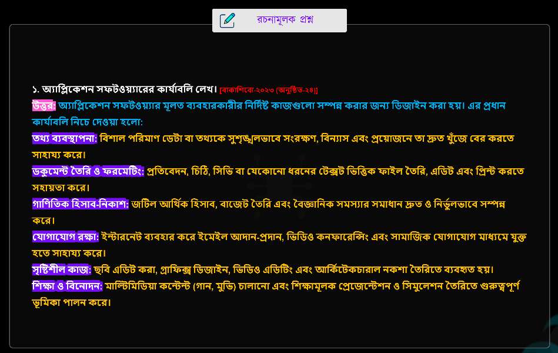
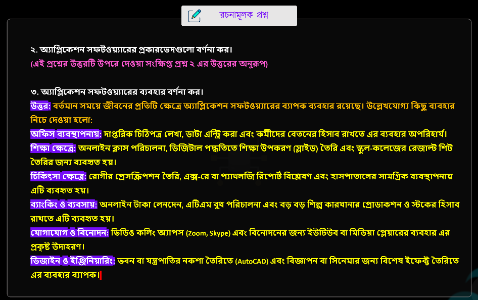

## 📝 অ্যাপ্লিকেশন সফটওয়্যার
> **Chapter Name: APPLICATION SOFTWARE**

--- 
<br>


<details>
<summary><strong>📘 Software Classification with Examples</strong></summary>

<br>

```text
Software
│
├── 1. System Software
│   │
│   ├── Operating System
│   ├── Device Driver
│   ├── Utility Software
│   └── Language Translator
│
└── 2. Application Software
    │
    ├── (i) Word Processor
    │   ├── Microsoft Word
    │   ├── Google Docs
    │   ├── LibreOffice Writer
    │   ├── WPS Writer
    │   └── Apple Pages
    │
    ├── (ii) Database Software
    │   ├── Microsoft Access
    │   ├── MySQL
    │   ├── Oracle Database
    │   ├── PostgreSQL
    │   └── SQLite
    │
    ├── (iii) Multimedia Software
    │   ├── VLC Media Player
    │   ├── Windows Media Player
    │   ├── KMPlayer
    │   ├── Audacity
    │   ├── Adobe Premiere Pro
    │   └── DaVinci Resolve
    │
    ├── (iv) Graphics Software
    │   ├── Adobe Photoshop
    │   ├── Adobe Illustrator
    │   ├── CorelDRAW
    │   ├── GIMP
    │   ├── Canva
    │   └── Inkscape
    │
    └── (v) Web Browser
        ├── Google Chrome
        ├── Mozilla Firefox
        ├── Microsoft Edge
        ├── Opera
        ├── Safari
        └── Brave
```


</details> 

<br>


---
---

### 📝 Notes + Suggestions (কারিগরি পাঠশালা)

> নিচের নোটগুলো **কারিগরি পাঠশালা**-এর Chapter 11-এর গুরুত্বপূর্ণ Concepts ও Suggestions-এর Screenshot।

<br>

<p align="center">
  
</p>

<br>

<p align="center">
  
</p>

<br>

<p align="center">
  
</p>

<br>

<p align="center">
  
</p>

<br>

<p align="center">
  
</p>

<br>

<p align="center">
  
</p>

<br>

<p align="center">
  
</p>

<br>

<p align="center">
  
</p>

```
```
